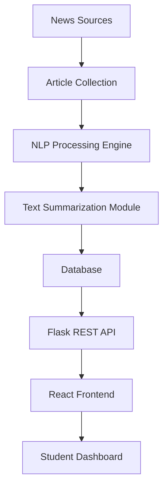

<div align="center">

# 📰 AI-Powered News Summarizer

### Intelligent Educational News Platform Powered by Natural Language Processing

A full-stack web platform that aggregates educational news articles and generates concise, AI-powered summaries, helping students stay updated quickly and efficiently without reading lengthy articles.


</div>

---

# 🌐 Project Overview

Students often spend significant time browsing multiple websites to stay informed about educational announcements, exam notifications, scholarship opportunities, and industry news.

AI-Powered News Summarizer solves this problem by collecting educational news articles and automatically generating concise summaries using Natural Language Processing techniques.

The platform enables students to quickly consume important information while reducing information overload and improving accessibility.

---

# ✨ Features

## 📰 Educational News Aggregation

- Collect educational and exam-related articles
- Display latest news updates
- Categorize articles for easier browsing
- Search and filter functionality

---

## 🤖 AI-Powered Summarization

- Automatic text summarization
- Extract key information from lengthy articles
- Generate concise and readable summaries
- Reduce reading time significantly

---

## 🔍 Smart Search

- Search by keywords
- Filter articles by category
- Discover relevant educational updates quickly

---

## 📱 Responsive User Interface

- Modern dashboard design
- Mobile-friendly layout
- Clean reading experience
- Intuitive navigation

---

# 🏗 System Architecture



---

# 🛠 Tech Stack

| Layer | Technology |
|-------|-------------|
| Frontend | React.js |
| Backend | Flask |
| Language | Python |
| Database | SQLite |
| AI | Natural Language Processing (NLP) |
| APIs | REST APIs |

---

# 📂 Project Structure

```text
AI-Powered-News-Summarizer/
│
├── exam-news-platform/
│   ├── frontend/
│   │   ├── public/
│   │   ├── src/
│   │   │   ├── components/
│   │   │   ├── pages/
│   │   │   ├── services/
│   │   │   └── assets/
│   │   │
│   │   └── package.json
│   │
│   ├── backend/
│   │   ├── app.py
│   │   ├── routes/
│   │   ├── services/
│   │   ├── summarizer/
│   │   ├── database/
│   │   └── requirements.txt
│   │
│   └── database/
│
├── screenshots/
│   ├── home.png
│   ├── summary.png
│   └── dashboard.png
│
├── README.md
└── LICENSE
```

---

# 📸 Application Screenshots

## 🏠 Home Page

<p align="center">
  
</p>

<p align="center">
  <em>Browse educational news articles from a modern dashboard.</em>
</p>

---

## 🤖 AI Generated Summary

<p align="center">
  
</p>

<p align="center">
  <em>Generate concise summaries from lengthy educational news articles.</em>
</p>

---

## 📊 Login Page

<p align="center">
  
</p>

<p align="center">
  <em>View and manage summarized educational news efficiently.</em>
</p>

---

# ⚙️ Installation

## Clone Repository

```bash
git clone https://github.com/Dharneesh0912/AI-Powered-News-Summarizer.git

cd AI-Powered-News-Summarizer
```

---

## Backend Setup

```bash
cd exam-news-platform/backend

pip install -r requirements.txt

python app.py
```

---

## Frontend Setup

```bash
cd exam-news-platform/frontend

npm install

npm start
```

---

# 🔐 Environment Variables

Create a `.env` file inside the backend directory.

```env
FLASK_APP=app.py
FLASK_ENV=development
DATABASE_URL=sqlite:///news.db
SECRET_KEY=your_secret_key
```

---

# 🗄 Database Design

## Articles

```python
{
  title,
  content,
  category,
  source,
  publishedAt,
  summary
}
```

## Users

```python
{
  name,
  email,
  password,
  createdAt
}
```

---

# 🔌 REST APIs

## News APIs

```http
GET /api/news
GET /api/news/:id
POST /api/news
```

## Summarization APIs

```http
POST /api/summarize
GET /api/summaries
```

---

# 🧪 Testing Checklist

- Fetch Articles
- Display News Dashboard
- Generate Summaries
- Search Functionality
- Filter Functionality
- Responsive Design
- API Error Handling
- Database Operations

---

# 🎯 Learning Outcomes

- Natural Language Processing Fundamentals
- Text Summarization Techniques
- REST API Development
- Full Stack Application Development
- Database Design
- React Component Architecture
- Backend Integration
- Responsive UI Design

---

# 🔒 Engineering Concepts Demonstrated

✅ Full Stack Development

✅ NLP-Based Text Processing

✅ RESTful APIs

✅ Database Modeling

✅ Component-Based Architecture

✅ State Management

✅ Responsive User Interfaces

✅ Software Engineering Best Practices

---

# 📈 Future Enhancements

- AI-powered recommendation engine
- Personalized news feed
- User authentication system
- Bookmark articles
- Multi-language summarization
- Speech-based article summaries
- Real-time notifications
- Cloud deployment with Docker and AWS
- Advanced analytics dashboard

---

# 🌟 Why This Project Matters

Information overload makes it difficult for students to keep up with educational updates and announcements. This platform demonstrates how Artificial Intelligence and Natural Language Processing can simplify information consumption by transforming lengthy articles into concise, meaningful summaries.

---

# 👨‍💻 Author

**Dharneesh R**

AI & Data Science Undergraduate  
Full Stack Developer | AI Enthusiast | Problem Solver

📧 Email: dharneesh912@gmail.com

🌐 Portfolio: https://dharneesh-portfolio-sigma.vercel.app/

💼 LinkedIn: https://www.linkedin.com/in/dharneesh-r-b65a57361

---

<div align="center">

### Building Intelligent Information Systems Through Artificial Intelligence

⭐ If you found this project useful, consider giving it a star.

</div>
